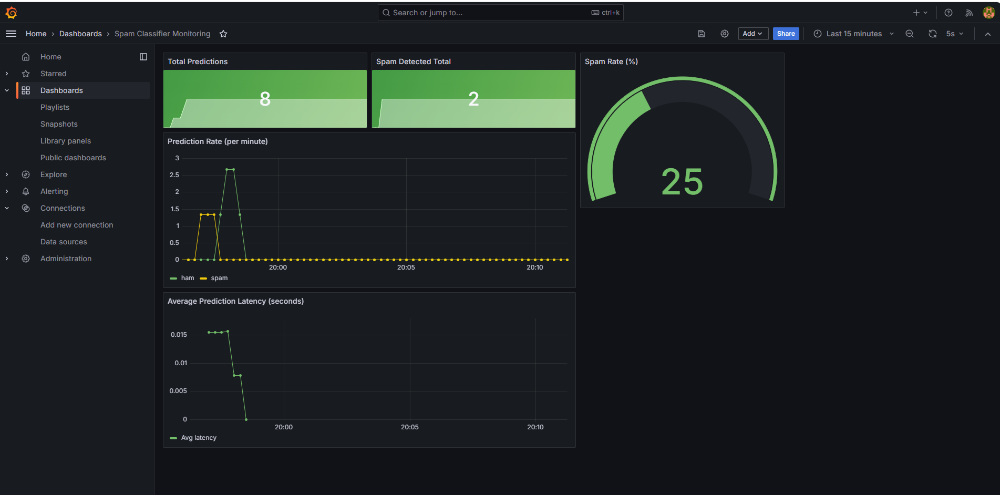

# Spam Classifier API

An MLOps portfolio project demonstrating end-to-end deployment of a machine learning model.


## Live Monitoring Dashboard



## Stack
- **Model**: BERT-tiny fine-tuned for SMS spam detection (Hugging Face)
- **API**: FastAPI with automatic OpenAPI docs
- **Container**: Docker with multi-layer caching
- **CI/CD**: GitHub Actions — test → build → push to registry
- **Monitoring**: Prometheus metrics + Grafana dashboard

## Metrics tracked
- Total predictions (spam vs ham)
- Average prediction latency (seconds)
- Spam detection rate (%)
- Prediction rate per minute

## Architecture
Every `git push` to main triggers:
1. Automated tests via pytest
2. Docker image build
3. Push to GitHub Container Registry (only if tests pass)

## Run locally

```bash
docker pull ghcr.io/fwill4040/spam-classifier-api:latest
docker run -p 8000:8000 ghcr.io/fwill4040/spam-classifier-api:latest
```

Then open http://localhost:8000/docs for the interactive API explorer.

## Example request

```bash
curl -X POST http://localhost:8000/predict \
  -H "Content-Type: application/json" \
  -d '{"text": "You have won a FREE iPhone! Click here to claim!"}'
```

## Example response

```json
{
  "text": "You have won a FREE iPhone! Click here to claim!",
  "label": "spam",
  "confidence": 0.9987,
  "is_spam": true
}
```

## Run tests locally

```bash
pip install -r requirements.txt
pytest tests/ -v
```